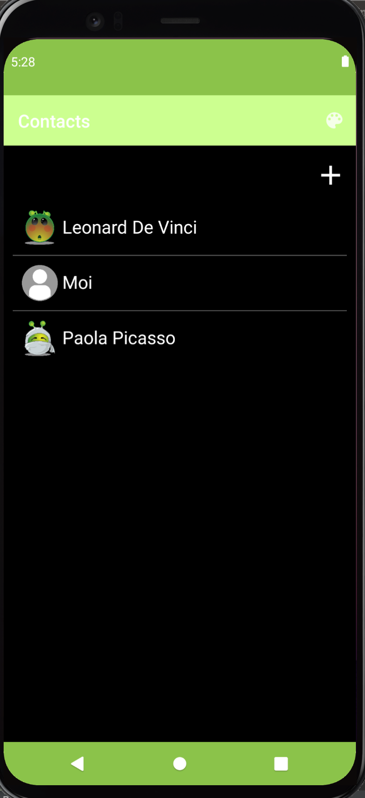
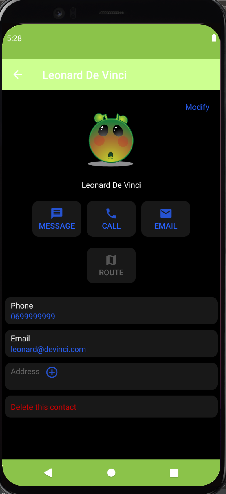
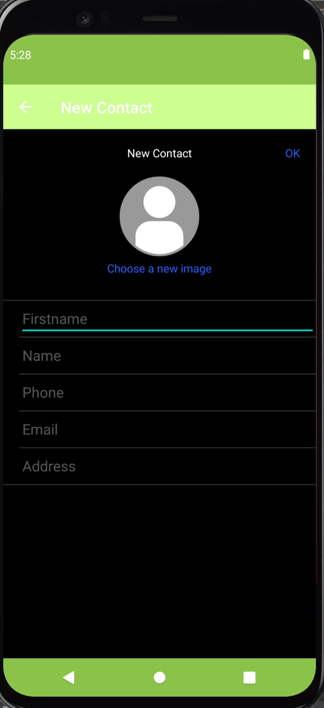

 📇 ft_hangout – Android Contact Manager

## 📝 Description  
**ft_hangout** est un projet d’initiation au développement d’applications Android en **Java**.  
L’objectif est de créer une application mobile de gestion de contacts, tout en découvrant le fonctionnement du système Android et l’utilisation de son SDK.

Ce projet m’a permis de comprendre :
- Le cycle de vie d’une application Android  
- La gestion des permissions et des composants système  
- L’utilisation des **Intents**, **Activities**, et **Fragments**  
- L’interaction avec les contacts du téléphone et l’UI Android

---

## 🛠️ Stack technique

- **Java**
- **Android SDK**
- **Android Studio**

---

## 🚀 Ce que j’ai appris

- Créer une application Android native en Java  
- Manipuler les composants Android (UI, intents, permissions)  
- Lire et modifier les contacts du téléphone  
- Gérer les interactions utilisateur dans un environnement mobile
